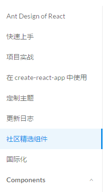

### 1.我们picked出来数据的用于页面的哪里？
```js
 pick: {
   components(markdownData) {
    //*
    },
     changelog(markdownData) {
        //*
    },
    'docs/pattern': pickerGenerator('pattern'),
    'docs/practice': pickerGenerator('practice'),
    'docs/react': pickerGenerator('react'),
    //*
    'docs/resource': pickerGenerator('resource'),
    'docs/spec': pickerGenerator('spec'),
  },
```
其中'docs/pattern','docs/practice','docs/react','docs/resource','docs/spec'都是用于页面头部的导航栏，因为这几个菜单的URL就是他们。而且他们实例化的都是`同一个组件（很厉害的抽象能力）`，在组件内部通过了window.location.pathname来获取到picked中的不同的数据！而且还有一点也是`很厉害的抽象`，那就是在点击左侧的导航的时候依然也是实例化该组件，而点击左侧组件的时候URL的开头就是`components`!

所以，在这种情况下我们需要传入`picked.components`内容。第一种就是：docs/react(本来就是访问组件的);点击左侧的`components`返回特定的组件;`changelog`也是需要的！其他的(上面代码块没有打星号的直接从picked中拿就可以了)

### 2.topLevel说明
```js
function getModuleData(props) {
  const pathname = props.location.pathname;
  const moduleName = /^\/?components/.test(pathname) ?
          'components' : pathname.split('/').filter(item => item).slice(0, 2).join('/');
  const moduleData = moduleName === 'components' || moduleName === 'docs/react' ||
          moduleName === 'changelog'?
          [...props.picked.components, ...props.picked['docs/react'], ...props.picked.changelog] :
          props.picked[moduleName];
  return moduleData;
}
```
因为对于docs/react,components,changelog来说他们的moduleData都是包含了components，docs/react,changelog三个部分。components部分没有什么好讲的，主要是为了展示组件的;docs/react包括了如何使用等等内容，而且都是一级的topLevel比较好理解;而changelog也是一级的。所以当你访问"docs/react"或者"component"开头的URL(左侧导航栏)的时候，左侧都会显示上面部分，就因为其他的是topLevel，而`component不是topLevel，所以会产生subMenu`！



### 3.category与topLevel关系
```js
{
  "Components": {
    "Feedback": [
      {
        "category": "Components",
        "subtitle": "警告提示",
        "type": "Feedback",
        "title": "Alert",
        "filename": "components/alert/index.zh-CN.md"
      }
    ],
    "General": [
      {
        "category": "Components",
        "type": "General",
        "title": "Button",
        "subtitle": "按钮",
        "filename": "components/button/index.zh-CN.md"
      }
    ]
  },
 //这上面的category为Components，而Components中每一个元素都是一个type,type里面才是真实的数据
  "topLevel": {
    "topLevel": [
      {
        "order": 0,
        "title": "Ant Design of React",
        "filename": "docs/react/introduce.md"
      },
      {
        "order": 1,
        "title": "快速上手",
        "filename": "docs/react/getting-started.zh-CN.md"
      },
      {
        "order": 2,
        "title": "安装",
        "filename": "docs/react/install.zh-CN.md"
      },
      {
        "order": 3,
        "title": "项目实战",
        "filename": "docs/react/practical-projects.zh-CN.md"
      },
      {
        "order": 4,
        "title": "定制主题",
        "filename": "docs/react/customize-theme.zh-CN.md"
      },
      {
        "order": 5,
        "title": "i18n 方案",
        "link": "//github.com/ant-design/intl-example",
        "filename": "docs/react/i18n-solution.zh-CN.md"
      },
      {
        "order": 6,
        "title": "更新日志",
        "toc": false,
        "timeline": true,
        "filename": "changelog.md"
      }
    ]
  }
}
```
第一级别为category，第二级别为type,每一个type都是一个数组，表示该type具有的组件的集合。没有指明category那么默认是topLevel，没有指明type默认也是topLevel。topLevel的category下也可以有特定type的数组，此时会被转化为`SubMenu`~